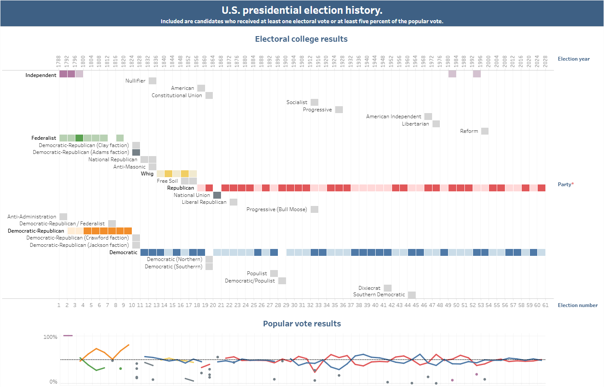

An interactive Tableau visualization of Wikipedia article "United States presidential election" (table "Electoral college results"):
https://public.tableau.com/app/profile/yury.ulasenka/viz/PoliticalpartiesintheU_S_presidentialelectionhistory/Politicalparties

Data: parties.xlsx
(https://en.wikipedia.org/wiki/United_States_presidential_election#Electoral_college_results + metadata)
